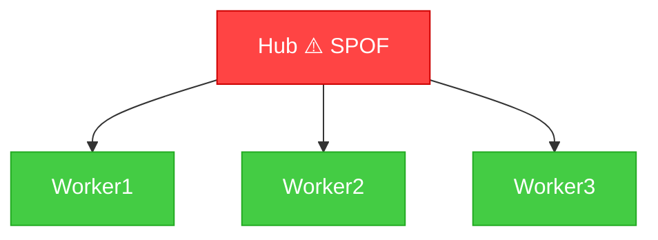

# swarm-test

**The first reliability testing framework for multi-agent AI systems.**

[](https://github.com/surajkumar811/swarm-test)

swarm-test builds a NetworkX interaction graph of your agent swarm and runs 5 automated chaos tests to surface cascade failures, context leakage, intent drift, collusion, and blast radius risks — all from a 3-line API.

**CrewAI, LangGraph, AutoGen — one tool.**

## GitHub Action

Drop swarm-test into your CI as a reliability gate on every PR. If your agent
system's reliability drops below the configured threshold, the build fails.

```yaml
# .github/workflows/swarm-test.yml
on: [pull_request]
jobs:
  swarm-test:
    runs-on: ubuntu-latest
    steps:
      - uses: actions/checkout@v4
      - uses: surajkumar811/swarm-test@v0.3.0
        with:
          script: my_crew.py
          fail-on-severity: high
```

Findings appear inline on the PR as `::error::` / `::warning::` / `::notice::`
annotations, and a swarm-score summary is posted to the workflow's job summary.
Add a badge to your repo:

```markdown
[](https://github.com/surajkumar811/swarm-test)
```

See [`.github/workflows/swarm-test-example.yml`](.github/workflows/swarm-test-example.yml)
for a fully-annotated reference workflow.

---

```python
from swarm_test import SwarmProbe

probe  = SwarmProbe(crew)
report = probe.run_all()
report.print_summary()
# First line of output:
# Swarm Score: 72/100 — NEEDS IMPROVEMENT (3 critical, 2 high findings)
```

---

## Output Modes

Every command (`probe`, `scan`, `run`) leads with a single **headline verdict
line** that tells you the swarm's reliability at a glance — perfect for CI logs
and dashboards.

```
Swarm Score: 92/100 — EXCELLENT (no findings)
Swarm Score: 72/100 — NEEDS IMPROVEMENT (3 critical, 2 high findings)
Swarm Score:  8/100 — CRITICAL (5 critical, 11 high findings)
```

| Flag | Output |
|---|---|
| `--quiet` / `-q` | Only the headline verdict (one line). Ideal for `if` checks in CI scripts. |
| *(default)* | Headline + test results table + CRITICAL / HIGH findings + SPOFs. |
| `--verbose` / `-V` | Headline + every finding (including LOW / INFO), graph metrics, full health & redundancy tables. |

```bash
swarm-test run my_crew.py --quiet           # CI-friendly: one line out
swarm-test run my_crew.py                   # default summary
swarm-test run my_crew.py --verbose         # full report
```

The same setting is available in `.swarmtest.yml`:

```yaml
output_verbosity: normal   # quiet | normal | verbose
```

## Interactive HTML Report

`--output-format html` renders a self-contained dashboard with a sticky
navigation bar, a live D3 force-directed agent graph (drag, zoom, click to
highlight neighbours), an NxN interaction heatmap, sortable health and
redundancy tables, and collapsible findings cards filterable by severity.

```bash
swarm-test run my_crew.py --output-format html --output-path report.html --open
```

`--open` launches the report in your default browser as soon as it's
generated. Single-points-of-failure pulse red on the graph; cells in the
heatmap that have findings are tinted red so you can jump straight to the
offending edge.

---

## Graph Export

Export your agent topology as **Mermaid**, **DOT**, or **PNG** to drop straight
into docs, wikis, or pull-request descriptions. SPOFs are coloured red,
moderate-redundancy agents orange, and fully redundant agents green — every
viewer can spot the risk at a glance.

```bash
# Mermaid (great for GitHub READMEs — renders inline)
swarm-test graph my_crew.py --format mermaid

# Save to a file
swarm-test graph my_crew.py --format mermaid --output topology.mmd
swarm-test graph my_crew.py --format dot --output topology.dot

# PNG (requires matplotlib)
pip install "swarm-test[png]"
swarm-test graph my_crew.py --format png --output topology.png
```

Or build a graph straight from the CLI with no Python script:

```bash
swarm-test graph --agents "Hub,W1,W2,W3" \
                 --edges "Hub<>W1,Hub<>W2,Hub<>W3" \
                 --format mermaid
```

Example Mermaid output (renders directly on GitHub):



The same formats are also available via `swarm-test run --output-format
{mermaid,dot,png} --output-path …`, so you can wire graph export into a
single CI run alongside the JSON / HTML reports.

---

## Features

| Test | What it checks |
|---|---|
| **Cascade Failure** | Which agents, if they fail, bring down the most of the swarm |
| **Context Leakage** | Sensitive data (credentials, PII) crossing agent boundaries |
| **Intent Drift** | Agents acting outside their role; prompt injection; goal hijacking |
| **Collusion Detection** | Dense cliques, echo chambers, orchestrator-bypass cycles |
| **Blast Radius** | Single points of failure, critical path, redundancy score |

### Redundancy Scoring

Every agent gets a **0-100 redundancy score** that quantifies how replaceable it is:

| Score | Level | Meaning |
|---|---|---|
| 0-20 | **IRREPLACEABLE** | Single point of failure — removing this agent breaks the swarm |
| 21-40 | LOW | Few or no peers can cover for this agent |
| 41-60 | MODERATE | Some overlap with peers; monitor |
| 61-80 | HIGH | Multiple peers can pick up the work |
| 81-100 | FULLY REDUNDANT | Failure is invisible — graph survives with no degradation |

The score is composed from five factors: **path redundancy** (30%), **role uniqueness** (25%), **tool coverage** (20%), **betweenness centrality** (15%), and **degree ratio** (10%). Agents detected as articulation points (SPOFs) are capped below 20.

#### Console output

```
                       Agent Redundancy
╭───────────────────────────────────────────────────────────────╮
│ Agent          Score      Level             Risk              │
│ Orchestrator   8/100      IRREPLACEABLE     SPOF              │
│ Writer         45/100     MODERATE          Monitor           │
│ Researcher     65/100     HIGH              Safe              │
│ Reviewer       82/100     FULLY REDUNDANT   Safe              │
╰───────────────────────────────────────────────────────────────╯
```

#### JSON output

```json
{
  "overall_redundancy": 50.0,
  "redundancy_scores": [
    {
      "agent_id": "abc-123",
      "agent_name": "Orchestrator",
      "agent_role": "orchestrator",
      "score": 8.0,
      "level": "IRREPLACEABLE"
    },
    {
      "agent_id": "def-456",
      "agent_name": "Researcher",
      "agent_role": "researcher",
      "score": 65.0,
      "level": "HIGH"
    }
  ]
}
```

---

### Supported Frameworks

| Framework | Adapter | Status |
|---|---|---|
| **CrewAI** | `CrewAIAdapter` | Stable |
| **LangGraph** | `LangGraphAdapter` | Stable |
| **AutoGen** | `AutoGenAdapter` — `GroupChat`, `GroupChatManager`, `ConversableAgent` | Stable |
| **Generic / static graph** | `BaseAdapter` | Stable |

---

## Installation

```bash
pip install swarm-test
# or with framework extras:
pip install "swarm-test[crewai]"
pip install "swarm-test[langgraph]"
pip install "swarm-test[langchain]"
pip install "swarm-test[autogen]"
```

From source:

```bash
git clone https://github.com/surajkumar811/swarm-test
cd swarm-test
pip install -e ".[dev]"
```

---

## Quick Start

### With a CrewAI crew

```python
from crewai import Crew, Agent, Task
from swarm_test import SwarmProbe

researcher = Agent(role="researcher", goal="...", backstory="...")
writer     = Agent(role="writer",     goal="...", backstory="...")
crew = Crew(agents=[researcher, writer], tasks=[...])

probe  = SwarmProbe(crew, swarm_name="my-crew")
report = probe.run_all()
report.print_summary()
report.to_html("report.html")   # D3 graph visualization
```

### With a LangGraph workflow

```python
from langgraph.graph import StateGraph
from swarm_test import SwarmProbe

graph = StateGraph(dict)
graph.add_node("researcher", researcher_fn)
graph.add_node("writer", writer_fn)
graph.add_edge("researcher", "writer")
compiled = graph.compile()

probe  = SwarmProbe(compiled, swarm_name="my-langgraph")
report = probe.run_all()
report.print_summary()
report.to_json("report.json")   # Structured JSON with stable finding IDs
```

### With an AutoGen GroupChat

```python
from autogen import ConversableAgent, GroupChat, GroupChatManager
from swarm_test import SwarmProbe

planner  = ConversableAgent(name="Planner",  system_message="...")
coder    = ConversableAgent(name="Coder",    system_message="...")
reviewer = ConversableAgent(name="Reviewer", system_message="...")

groupchat = GroupChat(
    agents=[planner, coder, reviewer],
    allowed_or_disallowed_speaker_transitions={
        planner:  [coder],
        coder:    [reviewer],
        reviewer: [planner],
    },
    speaker_transitions_type="allowed",
)
manager = GroupChatManager(groupchat=groupchat)

probe  = SwarmProbe(manager, swarm_name="my-autogen")
report = probe.run_all()
report.print_summary()
```

From the CLI:

```bash
swarm-test run autogen_app.py            # auto-detects `groupchat` / `manager`
```

### Static graph (no live swarm)

```python
from swarm_test import SwarmProbe, AgentNode, InteractionEvent, EventType

a = AgentNode(name="Fetcher", role="researcher")
b = AgentNode(name="Summarizer", role="writer")

probe = SwarmProbe(
    swarm_name="my-swarm",
    agents=[a, b],
    events=[InteractionEvent(
        source_agent_id=a.id,
        target_agent_id=b.id,
        event_type=EventType.TASK_DELEGATE,
    )],
)
report = probe.run_all()
report.print_summary()
```

### CLI

```bash
# Run against a Python script containing a `crew` variable
swarm-test probe my_crew.py --output report.html --fail-on-critical

# Static scan from the command line
swarm-test scan \
  --agents Researcher --agents Analyst --agents Writer \
  --edges "Researcher:Analyst" --edges "Analyst:Writer" \
  --output report.html
```

---

## Configuration

swarm-test supports a YAML config file for repeatable runs and CI gates.
Copy the example and edit it to taste:

```bash
cp .swarmtest.example.yml .swarmtest.yml
```

A minimal `.swarmtest.yml`:

```yaml
fail_on_severity: high        # critical | high | medium | low | info | none
max_blast_radius: 0.5         # 0.0 - 1.0 — findings above this threshold fail
disabled_tests:               # skip individual tests
  - collusion
sensitive_patterns:           # extra regexes added to the sensitive-data scanner
  - "INTERNAL-[A-Z0-9]+"
output_format: html           # console | json | markdown | html
output_path: ./swarm.html
quick_scan: false
timeout_seconds: 30
strict: false                 # treat ANY finding as a failure
```

Run with the new `run` subcommand:

```bash
swarm-test run --config .swarmtest.yml
swarm-test run -a "A,B,C" -e "A>B,B>C" --strict
swarm-test run my_crew.py --config custom-config.yml --output-format json
```

**Auto-discovery.** With no `--config` flag, swarm-test discovers
`.swarmtest.yml`, `.swarmtest.yaml`, or `swarmtest.yml` in the project root,
falling back to a `[tool.swarmtest]` table in `pyproject.toml`.

**CLI flags always override config-file values.** Exit codes from `run`:
`0` (passed), `1` (findings exceed thresholds), `2` (config or runtime error).

---

## Architecture

```
swarm_test/
├── core/
│   ├── models.py       # Pydantic models (AgentNode, Finding, SwarmReport, …)
│   ├── graph.py        # NetworkX SwarmGraph
│   ├── interceptor.py  # Monkey-patch agent methods, sensitive-data scanner
│   └── probe.py        # SwarmProbe — main entry point
├── attacks/
│   ├── cascade.py          # Cascade failure simulation
│   ├── context_leakage.py  # Sensitive-data boundary check
│   ├── intent_drift.py     # Role violations + goal hijacking
│   ├── collusion.py        # Clique/echo-chamber/cycle detection
│   └── blast_radius.py     # Topological SPOF + redundancy analysis
├── integrations/
│   ├── base.py                # BaseAdapter
│   ├── crewai_adapter.py      # CrewAI Crew ingestion
│   ├── langgraph_adapter.py   # LangGraph StateGraph / CompiledGraph ingestion
│   └── autogen_adapter.py     # AutoGen GroupChat / ConversableAgent ingestion
├── reporters/
│   ├── console.py          # Rich terminal output
│   └── html.py             # D3 force-directed graph report
└── cli.py                  # Click CLI
```

---

## Report Output

### Terminal (Rich)

```
─────────────────── SWARM-TEST RELIABILITY REPORT ───────────────────

 Summary
 Swarm: research-crew-demo    Framework: crewai
 Agents: 4   Edges: 6
 Risk Score: 45/100
 Duration: 12ms

╭─────────────────── Test Results ─────────────────────╮
│ Test                  Status   Findings  Critical  High │
│ cascade_failure       FAILED       2         1       1  │
│ context_leakage       PASSED       0         0       0  │
│ intent_drift          PASSED       0         0       0  │
│ collusion_detection   PASSED       0         0       0  │
│ blast_radius          FAILED       1         1       0  │
╰───────────────────────────────────────────────────────╯
```

### HTML Report

Interactive D3.js force-directed graph showing agent nodes, interaction edges, and color-coded findings.

---

## Plugin System

Ship custom reliability tests as installable Python packages. swarm-test
auto-discovers anything registered under the `swarm_test.plugins`
entry-point group and runs it alongside the built-in chaos tests — the
findings show up in the console, JSON, Markdown, and HTML reports.

### Write a plugin in 10 lines

```python
from swarm_test.plugins import BasePlugin, PluginResult


class MyPlugin(BasePlugin):
    name = "my_custom_test"
    version = "0.1.0"
    description = "Checks for X"

    def run(self, graph, agents, edges, config):
        findings = []
        # your test logic here
        return PluginResult(
            test_name=self.name,
            status="passed" if not findings else "failed",
            score=100,
            findings=findings,
            duration_ms=0.0,
        )
```

### Register the plugin

In your plugin package's `pyproject.toml`:

```toml
[project.entry-points."swarm_test.plugins"]
my_custom_test = "my_package.plugins:MyPlugin"
```

Then install it in the same environment as `swarm-test`:

```bash
pip install -e .
swarm-test plugins list   # → my_custom_test  0.1.0   Checks for X
swarm-test plugins info my_custom_test
```

From this point on every `swarm-test run`, `probe`, and `scan` will execute
your plugin and report its findings.

Need a working starting point? See
[`examples/plugin_template/`](examples/plugin_template/) for a fully
runnable plugin package, and
[`examples/example_plugin.py`](examples/example_plugin.py) for a
single-file edge-count check.

## Extending

### Custom attack

```python
from swarm_test.attacks.base import BaseAttack
from swarm_test.core.models import Finding, Severity, TestResult

class MyCustomAttack(BaseAttack):
    name = "my_custom_attack"

    def run(self, graph):
        findings = []
        # ... analyze graph.graph, graph.events ...
        return TestResult(test_name=self.name, findings=findings)
```

### Custom adapter

```python
from swarm_test.integrations.base import BaseAdapter

class MyFrameworkAdapter(BaseAdapter):
    framework_name = "my-framework"

    def _ingest_impl(self, swarm, graph):
        for raw_agent in swarm.my_agents:
            node = self._make_agent_node(raw_agent.name, raw_agent.role)
            graph.add_agent(node)
```

---

## Integrations

swarm-test exports (`agent_health` scores and structural findings) can feed runtime risk gates. Each integration has its own page under [`docs/integrations/`](docs/integrations/):

- [Black_Wall](docs/integrations/blackwall.md) — pre-action risk gate; consumes `agent_health` as a downside-only prior.

---

## Development

```bash
pip install -e ".[dev]"
pytest tests/ -v --cov=swarm_test
ruff check swarm_test/
black swarm_test/
```

---

## License

MIT — see [LICENSE](LICENSE).
