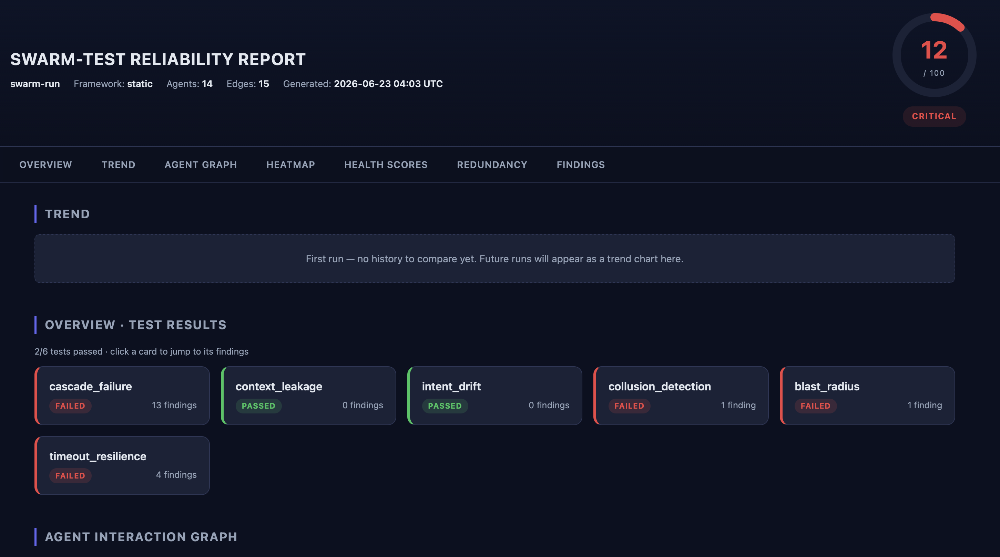

# swarm-test

**Find where your multi-agent AI system breaks — before production does.**

Static reliability testing for CrewAI, LangGraph, AutoGen, and custom agent systems. No live LLM calls, no API cost.

[](https://pypi.org/project/swarm-test/)
[](LICENSE)
[](https://github.com/surajkumar811/swarm-test)

---

## The problem

Chain 14 agents at 95% reliability each and your system is ~49% reliable end-to-end (`0.95^14`). The failures aren't inside any single agent — they're in how they connect: silent cascade failures, hidden single points of failure, fragile dependencies. swarm-test finds them by analyzing your agent topology.

## Quickstart

```bash
pip install swarm-test
swarm-test run my_crew.py --open
```

`--open` launches an interactive D3 dashboard in your browser the moment the run finishes — Swarm Score, force-directed agent graph with single-points-of-failure pulsing red, sortable health and redundancy tables, and every finding grouped by severity.

No real script handy? Build a synthetic topology straight from the CLI:

```bash
swarm-test scan -a "Orchestrator,Worker1,Worker2" -e "Orchestrator>Worker1,Orchestrator>Worker2"
```



<!-- Drop the dashboard screenshot at docs/images/dashboard.png. -->

## What it catches

- One agent fails and silently takes down everything downstream — *cascade failure*
- A single agent the whole system depends on; remove it and the swarm splits — *blast radius / SPOF*
- Credentials, PII, or other sensitive data leaking across agent boundaries — *context leakage*
- Agents drifting from their assigned role; prompt-injection-style goal hijacking — *intent drift*
- A slow upstream with no timeout boundary blocking the whole pipeline — *timeout resilience*
- Dense cliques, echo chambers, and cycles that bypass the orchestrator — *collusion detection*
- Agents stuck in loops — runaway step counts and retry storms that burn tokens with no error thrown — *trajectory analysis*
- Token-wasting structure — loops, retry-prone paths, and long chains that quietly burn your token budget — *cost risk analysis*
- Output schema mismatches across agent edges — *contract violation* (opt-in; provide a contracts YAML)

## Features

- 0–100 Swarm Score with a verdict line (EXCELLENT → CRITICAL) — one-line output for CI
- Agent role classification (orchestrator, aggregator, validator, gateway, worker, monitor, router) with confidence scores
- Role-adjusted severity — a validator leaking context is upgraded; an orchestrator's blast radius is downgraded
- Historical tracking — trend across runs, diffs new vs. resolved findings
- Interactive HTML report (`--open`) — D3 force-directed graph, NxN heatmap, filterable findings
- GitHub Action with PR annotations and job-summary score
- Graph export to Mermaid, DOT, or PNG (SPOFs red, redundant green)
- Framework adapters: CrewAI, LangGraph, AutoGen, generic / static graph
- YAML config (`.swarmtest.yml`) and entry-point plugin system

## CI gate (GitHub Action)

```yaml
# .github/workflows/swarm-test.yml
on: [pull_request]
jobs:
  swarm-test:
    runs-on: ubuntu-latest
    steps:
      - uses: actions/checkout@v4
      - uses: surajkumar811/swarm-test@v0.3.0
        with:
          script: my_crew.py
          fail-on-severity: high
```

Findings appear inline on the PR as `::error::` / `::warning::` / `::notice::` annotations; the Swarm Score is posted to the workflow job summary.

## Using it from Python

```python
from swarm_test import SwarmProbe

# Works with a CrewAI Crew, LangGraph CompiledGraph, or AutoGen GroupChatManager
probe  = SwarmProbe(crew, swarm_name="my-crew")
report = probe.run_all()
report.print_summary()
report.to_html("report.html")
```

## Installation

```bash
pip install swarm-test
# or with framework extras:
pip install "swarm-test[crewai]"
pip install "swarm-test[langgraph]"
pip install "swarm-test[autogen]"
pip install "swarm-test[png]"        # for PNG graph export
```

---

<details>
<summary><b>How it works</b></summary>

swarm-test builds a NetworkX directed graph from your agent system — nodes are agents, edges are interactions extracted by each framework adapter. All tests are static graph analyses; no LLM calls are made, and results are deterministic given the same topology.

- **Cascade failure** — simulates each agent failing in turn and measures downstream impact.
- **Blast radius** — detects articulation points (graph-theoretic SPOFs) and scores every agent on a 0–100 redundancy scale composed of path redundancy (30%), role uniqueness (25%), tool coverage (20%), betweenness centrality (15%), and degree ratio (10%).
- **Context leakage** — scans interaction payloads against a sensitive-data regex set extensible from `.swarmtest.yml`.
- **Intent drift** — flags agents whose observed behavior diverges from their declared role; includes prompt-injection heuristics.
- **Collusion** — finds dense cliques, echo chambers, and cycles that bypass the declared orchestrator.
- **Timeout resilience** — identifies long synchronous chains with no timeout boundary.
- **Trajectory analysis** — flags self-loops, ping-pong pairs, multi-agent feedback cycles, unbounded loops with no exit, repeated parallel calls, and cycles deeper than `max_trajectory_depth` (default 5).
- **Cost risk analysis** — relative 0–100 token-waste score from topology alone: unbounded loops (CRITICAL), feedback loops, fragile single-upstream retry-prone paths, long critical paths, and high fan-out nodes. Static estimate only — see the Cost Risk section below.
- **Contract violation** — validates agent outputs against JSON schemas declared per edge (opt-in; pass `--contracts contracts.yml`).

Roles are classified from structural metrics (in/out degree, betweenness centrality) plus naming hints, each with a 0–100% confidence score. Severity is then role-adjusted: an orchestrator with high blast radius is expected and gets downgraded; a validator leaking context is a security incident and gets upgraded.

</details>

<details>
<summary><b>Output modes &amp; formats</b></summary>

| Flag | Output |
|---|---|
| `--quiet` / `-q` | Headline verdict only (one line). Ideal for `if` checks in CI scripts. |
| *(default)* | Headline + test results + critical/high findings + SPOFs. |
| `--verbose` / `-V` | Every finding, graph metrics, full health and redundancy tables. |

Output formats via `--output-format`: `console`, `json`, `markdown`, `html`. The same verbosity setting is configurable in `.swarmtest.yml`.

</details>

<details>
<summary><b>Graph export</b></summary>

```bash
swarm-test graph my_crew.py --format mermaid
swarm-test graph my_crew.py --format dot --output topology.dot
swarm-test graph my_crew.py --format png --output topology.png   # needs the [png] extra
```

Mermaid renders inline on GitHub, so you can drop the output straight into a README or PR description. Colors: red = SPOF, orange = moderate redundancy, green = fully redundant.

</details>

<details>
<summary><b>Cost Risk</b></summary>

`cost_risk` adds a second headline line under the Swarm Score whenever it finds topology patterns that tend to waste tokens:

```
Swarm Score: 32/100 — AT RISK (2 critical, 4 high findings)
Cost Risk: 78/100 — HIGH (1 unbounded loop, 3 retry-prone paths)
```

The score is a **relative 0–100 structural estimate** with a verdict band (LOW / MODERATE / HIGH / SEVERE). Drivers are read from the graph alone:

- **Unbounded loops** (cycles with no exit edge) — CRITICAL: an unbounded loop can re-invoke its agents indefinitely.
- **Feedback loops with exit** — HIGH: per-cycle cost scales with cycle length.
- **Retry-prone paths** (single-upstream agents with no fallback) — MEDIUM-HIGH: retries re-spend the upstream's tokens.
- **Long critical paths** — MEDIUM: every request pays the full chain cost; a deep failure re-runs upstream work.
- **High fan-out nodes** — MEDIUM: each invocation multiplies token spend across the fan-out.

**Important:** this is a static estimate from topology only. It reports *which structures are most likely to waste tokens*, not *how many tokens you actually spent*. Real per-run cost measurement requires execution data — that's a separate, future capability and is intentionally out of scope here. No dollar amounts or currency are ever printed.

Disable with `disabled_tests: [cost_risk]` in `.swarmtest.yml`.

</details>

<details>
<summary><b>Historical tracking</b></summary>

Every run writes a small JSON snapshot to `.swarmtest-history/`. Subsequent runs print a trend line below the headline verdict:

```
Swarm Score: 72/100 — NEEDS IMPROVEMENT (3 critical findings)
Trend: ↑ +18 from last run (was 54) — improving
Recent: 54 → 61 → 58 → 72
✓ 3 findings resolved since last run
⚠ 1 new finding since last run
```

Browse with `swarm-test history show`. Disable per-run with `--no-history`, or globally via `history_enabled: false` in `.swarmtest.yml`. `.swarmtest-history/` is gitignored by default; commit it if you want the trend to survive across CI machines.

</details>

<details>
<summary><b>Configuration (.swarmtest.yml)</b></summary>

```yaml
fail_on_severity: high        # critical | high | medium | low | info | none
max_blast_radius: 0.5         # 0.0 – 1.0
disabled_tests:
  - collusion
sensitive_patterns:
  - "INTERNAL-[A-Z0-9]+"
output_format: html
output_path: ./swarm.html
timeout_seconds: 30
strict: false                 # treat ANY finding as a failure
```

Auto-discovers `.swarmtest.yml`, `.swarmtest.yaml`, `swarmtest.yml`, or a `[tool.swarmtest]` table in `pyproject.toml`. CLI flags always override config-file values. Exit codes from `run`: `0` (passed), `1` (findings exceed thresholds), `2` (config or runtime error).

</details>

<details>
<summary><b>Plugin system</b></summary>

Ship custom tests as installable Python packages. Register under the `swarm_test.plugins` entry-point group; swarm-test auto-discovers and runs them alongside the built-in tests:

```toml
[project.entry-points."swarm_test.plugins"]
my_custom_test = "my_package.plugins:MyPlugin"
```

```bash
swarm-test plugins list
```

See [`examples/plugin_template/`](examples/plugin_template/) for a runnable starter.

</details>

<details>
<summary><b>Framework examples (CrewAI, LangGraph, AutoGen, static)</b></summary>

```python
# CrewAI
from crewai import Crew
from swarm_test import SwarmProbe
SwarmProbe(crew, swarm_name="my-crew").run_all().print_summary()

# LangGraph
from langgraph.graph import StateGraph
from swarm_test import SwarmProbe
SwarmProbe(compiled_graph, swarm_name="my-langgraph").run_all().to_json("report.json")

# AutoGen
from autogen import GroupChatManager
from swarm_test import SwarmProbe
SwarmProbe(manager, swarm_name="my-autogen").run_all().print_summary()

# Static graph (no live framework)
from swarm_test import SwarmProbe, AgentNode, InteractionEvent, EventType
a = AgentNode(name="Fetcher", role="researcher")
b = AgentNode(name="Summarizer", role="writer")
SwarmProbe(
    swarm_name="my-swarm",
    agents=[a, b],
    events=[InteractionEvent(source_agent_id=a.id, target_agent_id=b.id, event_type=EventType.TASK_DELEGATE)],
).run_all().print_summary()
```

</details>

---

## Links

- **PyPI:** https://pypi.org/project/swarm-test/ — `pip install swarm-test`
- **Issues:** https://github.com/surajkumar811/swarm-test/issues
- **License:** MIT — free and open source

If swarm-test catches a real bug for you, please [star the repo](https://github.com/surajkumar811/swarm-test) — it helps other teams find it.
